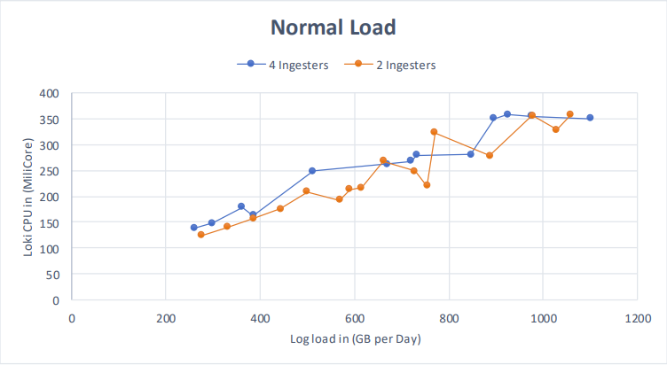
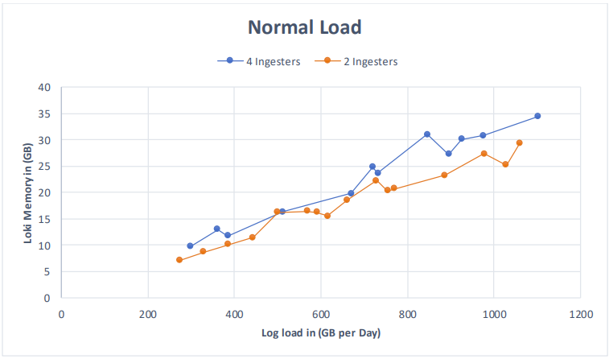
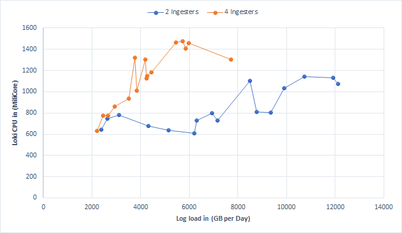
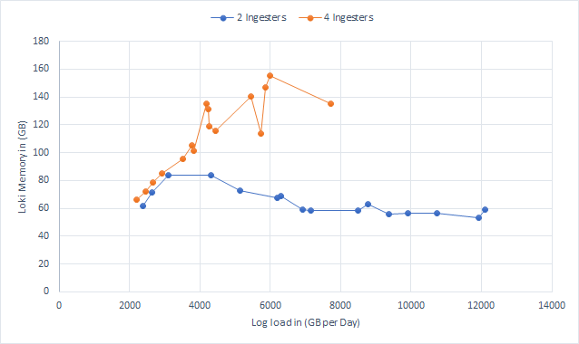

# Benchmark Report

## Goal
We want to give the user the opportunity to know the minimum size of OCP cluster that can stand for his daily logs written and read from Loki. Our goal is to create a table that specifies for each "T-shirt" size the average and max daily read and write capabilities of Loki.

## Environment
We ran that on OpenShift running on AWS clusters with configuration:

	apiVersion: v1
	baseDomain: devcluster.openshift.com
	compute:
	- architecture: amd64
	hyperthreading: Enabled
	name: worker
	platform:
		aws:
		type: m4.16xlarge
		rootVolume:
			type: io1
			size: 500
			iops: 8000
	replicas: 6
	controlPlane:
	architecture: amd64
	hyperthreading: Enabled
	name: master
	platform: {}
	replicas: 3

Running with 64 vCPUs and 256 Memory (GiB)

## The Proccess Of Creating The Table
The benchmark tool helps us observe the data (such as CPU, Memory, etc...) of Loki while sending a different amount of logs each test, the logs are sent by a logger that is deployed when the benchmark test is started (the implementation can be seen at https://github.com/ViaQ/cluster-logging-load-client).

We have been observing mainly the CPU (in MiliCore) and Memory (in GB) as a function of the GiPD (Log load in GB per Day) to see how they change, we ran the benchmark test with different values of GiPD and watched over the CPU and Memory and how the number of Ingesters may affect these values in Loki. First, we ran Loki with 2 Ingesters and then we ran it with 4 Ingesters.

Then a high amount of logs has been sent to Loki by running different values between 2250GB and 6000GB per day (starting with 2250Gb then 2500GB ... and so on until 6000GB). Sending this amount of GB to Loki with 2 Ingesters made the GiPD go too high compared to what has been sent, but the GiPD in Loki with 4 Ingesters was pretty much normal.

The commands that have been used to recieve the information of CPU, Memory and GiPD are:

Getting the GiPD:

	`sum(rate(loki_distributor_bytes_received_total{[label]=~".*[job].*"}[duration])) / BytesToGigabytesMultiplier * 86400` 
	we devide by BytesToGigabytesMultiplier * 86400 in order to convert to Gi per day

Getting the CPU:

	`sum(rate(container_cpu_user_seconds_total{[label]=~".*[job].*"[duration]]) * 1000)`

Getting the Memory:

	`sum(avg_over_time(container_memory_working_set_bytes{[label]=~".*[job].*"}[duration]) / %BytesToGigabytesMultiplier)`
	we devide to convert to Gi

## Graphs

